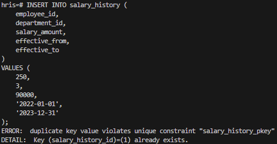
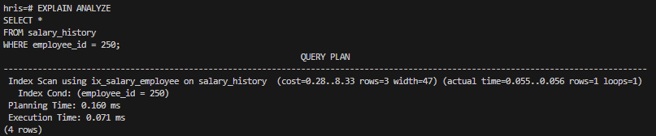
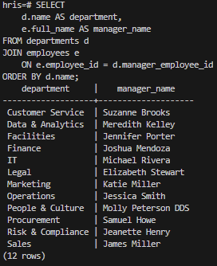

🏢 HRIS Database Engineering Project
**📌 Project Overview**

This project is a production-style Human Resources Information System (HRIS) built from scratch using modern database engineering principles.

It demonstrates:

Relational schema design

Referential integrity enforcement

Advanced PostgreSQL constraints

Synthetic data generation with Python

Bulk data loading using COPY

Containerised database deployment with Docker

Performance validation using EXPLAIN ANALYZE

The goal of this project is to move beyond academic SQL usage and demonstrate real-world database engineering discipline.

**🧰 Technology Stack**
Component	Technology
Database	PostgreSQL 16
Containerisation	Docker
Data Generation	Python + Faker
Data Loading	psycopg (COPY)
Version Control	Git + GitHub
Advanced Constraints	GiST + Exclusion Constraints
🏗 System Architecture
Docker (Postgres Container)
        ↓
Schema (DDL Scripts)
        ↓
Python Faker Generator
        ↓
Bulk Load via COPY
        ↓
Constraints + Indexing
        ↓
Performance Validation

🗄 Database Schema
Core Entities

Departments

Roles

Employees

Employee Roles (Many-to-Many)

Employment Contracts

Salary History

Leave Requests

Performance Reviews

**🔗 Relationship Highlights**

Each Role belongs to a Department

Each Employee has one primary role (optionally secondary)

Each Employee has one active contract (historical allowed)

Each Department has a manager (must belong to that department)

Salary periods cannot overlap per employee

Leave end dates must be ≥ start dates

**🔐 Data Integrity & Engineering Features**
**✅ Referential Integrity**

Foreign key constraints prevent orphan records

Manager must belong to their department

**✅ Logical Constraints**
CHECK (salary_amount > 0)
CHECK (end_date >= start_date)

**✅ Unique Constraints**
UNIQUE (department_id, title)

**✅ Advanced Exclusion Constraint (PostgreSQL Feature)**

Prevents overlapping salary periods:

EXCLUDE USING gist (
  employee_id WITH =,
  daterange(effective_from, COALESCE(effective_to, 'infinity'::date), '[]') WITH &&
);


This demonstrates real-world temporal data modelling.

**⚡ Performance & Optimisation**
Example Query
EXPLAIN ANALYZE
SELECT e.employee_id, e.full_name, r.title, d.name
FROM employees e
JOIN employee_roles er ON er.employee_id = e.employee_id
JOIN roles r ON r.role_id = er.role_id
JOIN departments d ON d.department_id = r.department_id
WHERE er.is_primary = true;

Index Strategy
CREATE INDEX ix_roles_department ON roles(department_id);
CREATE INDEX ix_employee_roles_employee ON employee_roles(employee_id);
CREATE INDEX ix_salary_employee ON salary_history(employee_id);

**📊 Synthetic Data Generation**

Data is generated using Python + Faker (en_AU locale).

Generated volumes:

1,000 Employees

45 Roles

2,978 Salary Records

4,169 Leave Requests

2,451 Performance Reviews

Generation ensures:

Valid foreign keys

No salary overlaps

Realistic employment timelines

Valid department-manager relationships

🚀 How To Run
**1️⃣ Start PostgreSQL Container**
docker compose up -d

**2️⃣ Apply Schema**
docker exec -it hris_postgres psql -U postgres -d hris -f /sql/01_tables.sql
docker exec -it hris_postgres psql -U postgres -d hris -f /sql/02_constraints.sql
docker exec -it hris_postgres psql -U postgres -d hris -f /sql/03_indexes.sql

**3️⃣ Generate Synthetic Data**
.\.venv\Scripts\python.exe python/generate_data.py

**4️⃣ Load Data into PostgreSQL**
.\.venv\Scripts\python.exe python/load_data.py

**5️⃣ Verify Data**
SELECT COUNT(*) FROM employees;

📸 Screenshots

## 📸 Database Tables Overview

The HRIS schema includes 8 fully normalised relational tables with enforced foreign keys and constraints.


## 🔐 Salary Overlap Protection

The system prevents overlapping salary periods per employee using a PostgreSQL exclusion constraint.




## ⚡ Indexed Salary Lookup Performance

Performance validated using `EXPLAIN ANALYZE`.




## 🧠 Department Manager Integrity Validation

Managers must belong to the department they manage.




**🧠 Engineering Concepts Demonstrated**

Normalised relational modelling

Many-to-many relationship design

Window functions (row_number())

Exclusion constraints for temporal integrity

Docker-based reproducible environments

Idempotent bulk loading

Referential integrity validation queries

Query performance analysis

**🔮 Future Enhancements**

Enforce only one active primary role per employee

Add audit logging via triggers

Implement Slowly Changing Dimensions (Type 2)

Partition salary_history by year

Add CI pipeline to auto-run schema validation

**🎯 Why This Project Matters**

This project demonstrates the transition from:

“I can write SQL queries”

to

“I can design, enforce, and maintain a production-grade relational database system.”

It reflects real-world database engineering practices used in enterprise HR systems.


## 🧩 Entity Relationship Diagram (ERD)

```mermaid
erDiagram
    DEPARTMENTS {
        bigint department_id PK
        text name
        bigint manager_employee_id FK
        timestamptz created_at
    }

    ROLES {
        bigint role_id PK
        bigint department_id FK
        text title
        boolean is_active
        timestamptz created_at
    }

    EMPLOYEES {
        bigint employee_id PK
        text full_name
        date date_of_birth
        text address_line1
        text address_suburb
        text address_state
        text address_postcode
        text tfn_last4
        text tfn_hash
        boolean is_active
        timestamptz created_at
    }

    EMPLOYEE_ROLES {
        bigint employee_id FK
        bigint role_id FK
        boolean is_primary
        date start_date
        date end_date
    }

    EMPLOYMENT_CONTRACTS {
        bigint contract_id PK
        bigint employee_id FK
        date start_date
        date end_date
        text employment_type
        numeric hours_per_week
        timestamptz created_at
    }

    LEAVE_REQUESTS {
        bigint leave_request_id PK
        bigint employee_id FK
        date start_date
        date end_date
        text leave_type
        text status
        timestamptz created_at
    }

    PERFORMANCE_REVIEWS {
        bigint review_id PK
        bigint employee_id FK
        date review_date
        numeric score
        text comments
        bigint reviewing_department_id FK
        bigint employee_department_id FK
        timestamptz created_at
    }

    SALARY_HISTORY {
        bigint salary_history_id PK
        bigint employee_id FK
        bigint department_id FK
        numeric salary_amount
        date effective_from
        date effective_to
        timestamptz created_at
    }

    %% Relationships
    DEPARTMENTS ||--o{ ROLES : contains
    ROLES ||--o{ EMPLOYEE_ROLES : assigned_to
    EMPLOYEES ||--o{ EMPLOYEE_ROLES : has
    EMPLOYEES ||--o{ EMPLOYMENT_CONTRACTS : has
    EMPLOYEES ||--o{ LEAVE_REQUESTS : requests
    EMPLOYEES ||--o{ PERFORMANCE_REVIEWS : receives
    EMPLOYEES ||--o{ SALARY_HISTORY : has

    DEPARTMENTS ||--o{ PERFORMANCE_REVIEWS : reviewing_dept
    DEPARTMENTS ||--o{ PERFORMANCE_REVIEWS : employee_dept
    DEPARTMENTS ||--o{ SALARY_HISTORY : paid_in

    EMPLOYEES }o--|| DEPARTMENTS : manages
    


